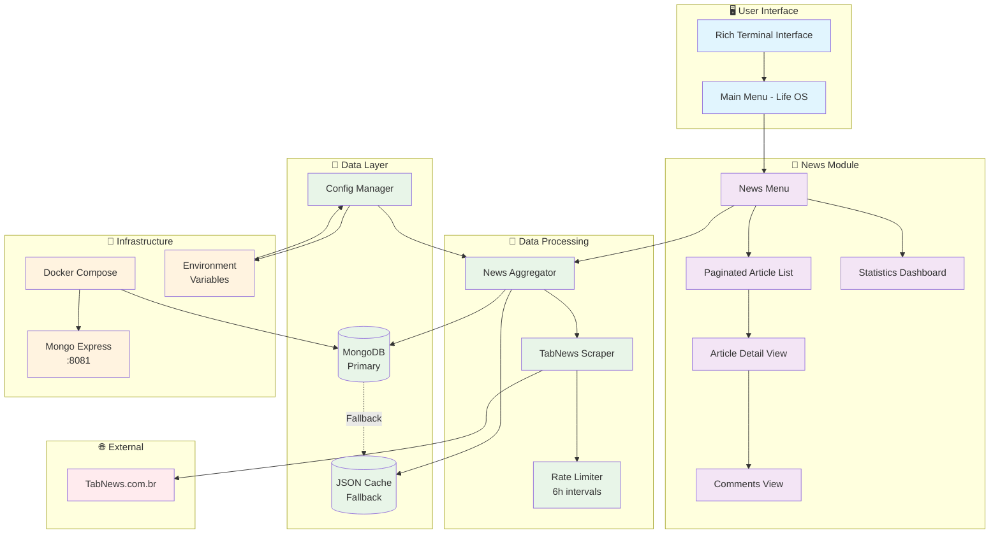
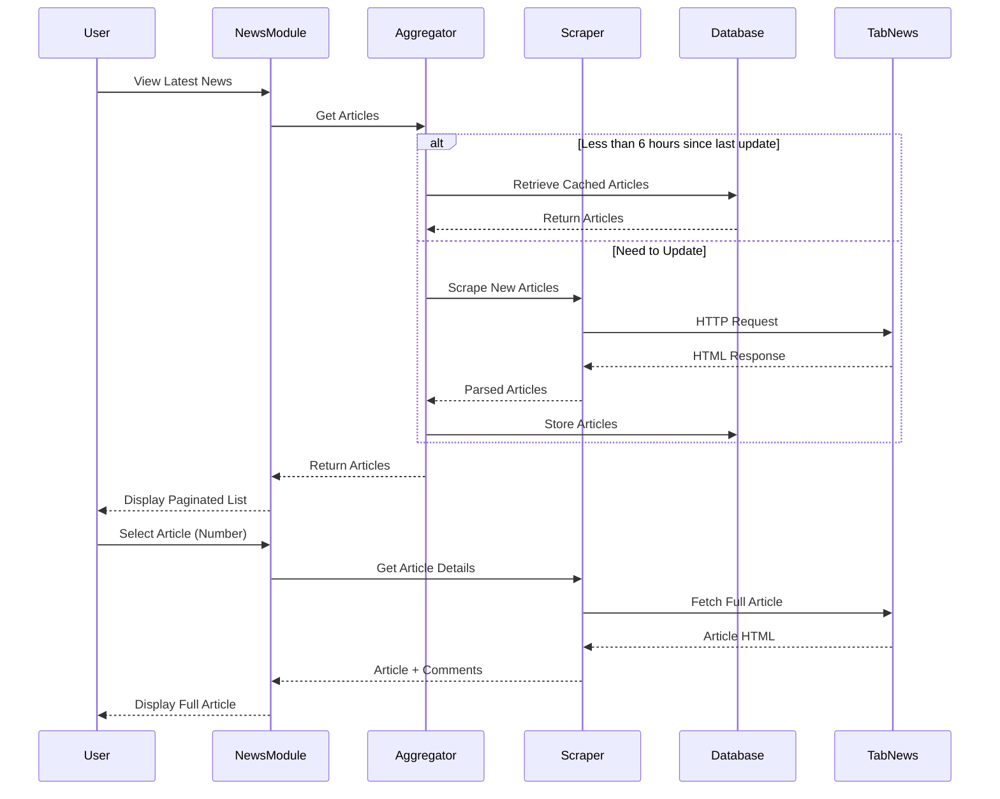
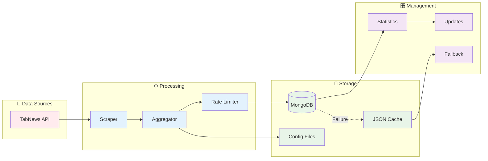

# 🧠 Life OS - Sistema de Organização Pessoal

> Sistema modular de linha de comando para organização pessoal com agregação inteligente de notícias

[](https://python.org)
[](https://mongodb.com)
[](https://docker.com)
[](https://rich.readthedocs.io)

## 🚀 Quick Start

```bash
# 1. Clone e instale dependências
git clone <repository-url>
cd life-os
pip install -r requirements.txt

# 2. Inicie o MongoDB (recomendado)
./scripts/start-mongodb.sh

# 3. Execute o Life OS
python main.py
```

## ✨ Features

### 📰 **Módulo de Notícias** (Implementado)
- 🔄 **Agregação Inteligente**: Coleta automática do TabNews com rate limiting e TTL de 5 dias
- 📖 **Leitura Completa**: Visualização instantânea de artigos e comentários no terminal
- 💾 **Persistência Robusta**: MongoDB com cache de artigos detalhados e fallback JSON
- 🎛️ **Interface Rica**: Navegação interativa com atalho 'M' para menu principal
- ⚡ **Performance**: Cache inteligente com atualizações de 6h e limpeza automática
- 🎯 **Extração Avançada**: 89% de taxa de extração de comentários sem duplicatas

### 🔮 **Módulos Futuros**
- 📅 **Agenda**: Gerenciamento de compromissos e eventos
- ✅ **Tarefas**: Sistema de gerenciamento de tarefas e projetos
- 💰 **Finanças**: Controle financeiro pessoal
- 📝 **Notas**: Sistema de anotações e documentação
- 🎯 **Hábitos**: Rastreamento e desenvolvimento de hábitos

## 🏗️ System Architecture



## 🔧 Architecture Components

### **User Interface Layer**
- **Rich Terminal UI**: Interface moderna com cores e formatação
- **Modular Navigation**: Menu principal → Módulos → Funcionalidades
- **Responsive Design**: Adaptável a diferentes tamanhos de terminal

### **News Module Workflow**


### **Data Flow & Persistence**


## 🛠️ Installation & Setup

### Prerequisites
- **Python 3.8+**
- **Docker & Docker Compose** (recomendado)
- **Git**

### Step-by-Step Installation

1. **Clone Repository**
   ```bash
   git clone <repository-url>
   cd life-os
   ```

2. **Install Dependencies**
   ```bash
   pip install -r requirements.txt
   ```

3. **Setup Environment** (Opcional)
   ```bash
   cp .env.example .env
   # Edit .env if needed
   ```

4. **Start MongoDB** (Recomendado)
   ```bash
   ./scripts/start-mongodb.sh
   ```

5. **Launch Life OS**
   ```bash
   python main.py
   ```

### Alternative: JSON-Only Mode
```bash
# Skip MongoDB setup and run with JSON fallback
python main.py
```

## 📖 Usage Guide

### Basic Navigation
1. **Main Menu**: Choose module (currently only News available)
2. **News Module**: 
   - `1` - View latest articles (with instant cache loading)
   - `2-5` - Manage sources and settings
   - `6` - View database statistics with article cache metrics
   - `M` - Return to main menu from any submenu
3. **Article List**: Type article number to read full content instantly
4. **Article View**: Switch between content and comments with enhanced navigation

### Advanced Features
- **Force Update**: Option 5 in News Menu
- **Statistics**: Option 6 shows MongoDB status and update times
- **Source Management**: Add/remove news sources dynamically

## 🔧 Configuration

### Environment Variables (.env)
```bash
# MongoDB Configuration
MONGODB_HOST=localhost
MONGODB_PORT=27017
MONGODB_DATABASE=lifeos
MONGODB_USERNAME=lifeos_app
MONGODB_PASSWORD=lifeos_app_password

# Application Settings
NEWS_UPDATE_INTERVAL_HOURS=6
MAX_ARTICLES_PER_SOURCE=50
DEBUG=false
```

### Docker Services
- **MongoDB**: Primary database (port 27017)
- **Mongo Express**: Web interface (http://localhost:8081)

## 📊 Monitoring

### Built-in Statistics
- MongoDB connection status
- Last update times per source
- Article count per source
- Update intervals and next scheduled updates

### External Monitoring
- **Mongo Express**: http://localhost:8081 (database web interface)
- **Docker Logs**: `docker-compose logs mongodb`
- **System Status**: News Module → Option 6

## 🚨 Troubleshooting

### Common Issues

**MongoDB Connection Failed**
```bash
# Check Docker status
docker ps | grep lifeos-mongodb

# Restart MongoDB
./scripts/stop-mongodb.sh
./scripts/start-mongodb.sh
```

**No Articles Loading**
```bash
# Force manual update
python -c "
from utils.news_aggregator import NewsAggregator
from utils.config_manager import ConfigManager
news = NewsAggregator(ConfigManager())
news.force_update_all()
"
```

**Permission Denied on Scripts**
```bash
chmod +x scripts/*.sh
```

## 🔮 Roadmap

### Phase 1: News Enhancement ✅
- [x] MongoDB integration with Docker and TTL indexes
- [x] Full article reading with comments and 89% extraction rate
- [x] Rate limiting, caching, and automatic cleanup
- [x] Statistics and monitoring with cache metrics
- [x] Rich terminal interface with direct navigation shortcuts
- [x] Article details caching system with 6-hour updates
- [x] Enhanced comment extraction with duplicate filtering

### Phase 2: Multi-Source News 🚧
- [ ] Dev.to scraper
- [ ] Hacker News integration
- [ ] Reddit technology subreddits
- [ ] GitHub Trending

### Phase 3: Additional Modules 📋
- [ ] Calendar/Agenda module
- [ ] Task management system
- [ ] Personal finance tracker
- [ ] Note-taking system
- [ ] Habit tracker

### Phase 4: Advanced Features 🎯
- [ ] AI-powered content classification
- [ ] REST API for external integrations
- [ ] Mobile companion app
- [ ] Browser extension

## 🤝 Contributing

### Adding New Scrapers
1. Create scraper class in `scrapers/`
2. Implement `scrape_artigos()` and `scrape_artigo_detalhado()` methods
3. Register in `NewsAggregator.scrapers`
4. Add to `ConfigManager.available_sites`

### Development Setup
```bash
# Install development dependencies
pip install -r requirements.txt

# Run tests
python -c "from scrapers.tabnews_scraper import TabNewsScraper; print('✅ Scraper OK')"

# Check system status
python -c "from utils.config import Config; Config.print_config()"
```

## 📄 License

This project is licensed under the MIT License - see the [LICENSE](LICENSE) file for details.

## 🙏 Acknowledgments

- **TabNews**: Primary news source (https://tabnews.com.br)
- **Rich**: Beautiful terminal interfaces (https://rich.readthedocs.io)
- **MongoDB**: Robust document database
- **Docker**: Containerization platform

---

<div align="center">

**[⬆ Back to Top](#-life-os---sistema-de-organização-pessoal)**

Made with ❤️ using Python, MongoDB, and Rich Terminal UI

</div>